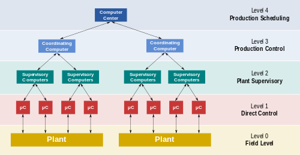

:PROPERTIES:
:ID:       8819b564-caa6-4101-99ca-ab936c650714
:ROAM_TAGS: SCADA
:END:
#+title: SCADA
#+SETUPFILE: /home/unseen/Documents/Notes/org/roam/org-setup.org

#+CREATED: [2022-12-17 12:03:14]
#+LAST_MODIFIED: [2022-12-18 Sun 23:09]
#+author: NSASPY
#+filetags: scada

+ [[id:c72d4e02-0e32-424c-b4b3-c471adbf4598][Index]]
* TODO SCADA :SCADA:
:PROPERTIES:
:ID:       c9820d4a-127c-44f6-ad6c-8941d1cd7273
:PUBDATE:  <2023-06-30 Fri 01:03>
:END:

#+begin_quote
There once was a city that lost its might
After a SCADA hack in one single night
The power went out
And all we could shout
Is "How could this happen, oh what a sight!" - Anon
#+end_quote

Supervisory control and data acquisition is a control system for high level supervision of machines and processes.
It is used with Programable Logic controllers which control the processes/machines.

** Control Operations
:PROPERTIES:
:ID:       b9009461-2248-4da0-b240-fac5acbb805b
:END:

#+DOWNLOADED: screenshot @ 2022-12-09 00:56:45

*** Level 0
:PROPERTIES:
:ID:       9def9397-71e8-4848-803c-3abc7d050e30
:END:
Field Level devices.
examples:
 + Temperature sensors
 + Control valves
 + Flow sensors

*** Level 1
:PROPERTIES:
:ID:       e0ede1b9-aa09-4286-9c36-cac3825439ad
:END:
Level 1 contains input/output devices, and related processors
This is where you will find Programmable logic controllers and remote terminal units.

*** Level 2
:PROPERTIES:
:ID:       82eb21d0-cf92-4943-aa92-7ad82080201d
:END:
Cotains readsing and reports. Data is formated so that a operator using a Human Machine interface can make operating decisions to adjust or overide RTU or PLC controls.
Data is Fed into a historian, which is often just a normal DBMS. The historian is used for analytics.

*** Level 3
:PROPERTIES:
:ID:       c1495c55-ed03-4cd3-8d22-c3eb1122327c
:END:
Deals with production control level. it doesnt control the process but instead manages taget goals and monitoring.
*** Level 4
:PROPERTIES:
:ID:       d588b9b2-84f0-44ee-82e5-ec0d0a3e7ef0
:END:
Production scheduling

** Generations of SCADA
:PROPERTIES:
:ID:       9eae8c47-54eb-4bae-a3f0-b69ed60100c5
:END:
Scada has evolvedd over the years as tech improved
*** First Generation Monolithic
:PROPERTIES:
:ID:       d524bb59-b65f-4d3c-89f9-fe5081ee2a22
:END:
Early Scada was done by larg minicomputuers. Networks didnt exists at the the time. At this point they was indpendent systems with no networking. Communication protocols was proprietary. Some was developed as turn key operations and ran on the PDP-11

*** Secend Generation Distributed
:PROPERTIES:
:ID:       88cfc48b-b7a5-42c8-998b-de78e3e3eb5a
:END:
SCADA info and commands was distributed across multiple sites and was connected through a lan. Information was sent in real time. Each station was responsible for a task, which was more light weight at the time. Networking was not standardized. since they was proprietary few people knew if they newtork was secure.

*** Third Generation Networked
:PROPERTIES:
:ID:       c7ef8e62-64e0-478b-83c8-203cd882f2a9
:END:
Like a Distributed network many systems can be reduced and networked through communications protocols. The network can be spread acrosse more than one LAN called a [[id:272b8475-d721-4782-9f7b-ba914c1a6597][Process Control network]].

*** Forth Generation Web based
:PROPERTIES:
:ID:       ce0945d3-451d-44f0-b15f-67313525e087
:END:
This is where we are, the crux of problems
With the advent of the internet let many SCADA systems to implement Web based Human machine interfaces and control panles

*** Future: Cloud based
:PROPERTIES:
:ID:       054d0536-bfad-488f-94d4-e97223201d41
:END:
Some are now using cloud based tech but the extent beyond just for analytics is not known as this needs more research.
