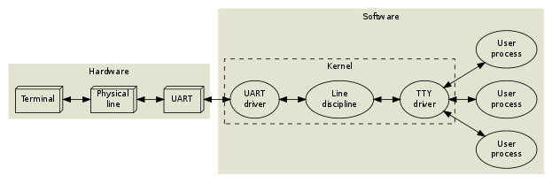

:PROPERTIES:
:ID:       1d99b0b9-bc9e-4578-8e96-8defb97cf49b
:END:
#+TITLE: the tty demystified
#+CREATED: [2022-12-27 Tue 11:41]
#+LAST_MODIFIED: [2022-12-29 Thu 18:58]

* The TTY demystified Notes
#+begin_quote
In 1869, the stock ticker was invented. It was an electro-mechanical machine consisting of a typewriter, a long pair of wires and a ticker tape printer, and its purpose was to distribute stock prices over long distances in realtime
#+end_quote

#+DOWNLOADED: screenshot @ 2022-12-27 11:45:00

#+CAPTION: Teletype diagram
** The tty
*** Line editing

People make mistakes so backspaces are a neccisty. These features are often implemented in a program running in raw mode (curses or readline) but unix programs should be small, so these features can be exposed to the program via a line discipline. Some basic editing commands are

+ Backspace

+ Erase word

+ clear line

+ Reprint

Line discipline has utilities for line feeds and carriage returns.

The kernel provides different line disciplines and only one of them are running at a time.
The default line discipline is N_TTY which is defined in `drivers/char/n_tty.c`

*** Sessions

Users often need to run multiple programs at the same time. User input should only go to the foreground program and not background programs.

A process is "alive" and can preform actions, a tty is not "alive". A tty is a passive object. it has data fields and methods but it only does something when a process or the kernel calls a method. Same goes for the line discipline.

A UART driver, line discipline and TTY driver is called a tty device.

**** How the linux console and others work

There is no UART instead a video terminal is used. A video terminal is a complex state machine that consists of a framebuffer and charecter attributes.

the console is rigid and gets more abstract as you move into userland.

To move the terminal to userland the pseudo terminal was invented.  Linux process can be these states+ R Running or runnable (on queue)

+ D Uninterruptible sleep

+ S Interruptible sleep

+ T Stopped, either by a job control signal or because of debugger+ Zombie process, terminated but not yet reaped by its parent.

*** Jobs and sessions
Job control is a way to control backround jobs. A job is the same as a process group
you can invck job control with ^Z.
there are internal shell commands to maniplate jobs within a session.
The shell commands are
+ jobs List jobs
+ fg bring job to foreground
+ bg move job to backround

The TTY driver keeps track of the foreground but only passivly. The sessionleader must update this information.
The session leader also keeps track of the size of the connected terminal but must be updated by the terminal emulator or the user.
*** Signals
A signal is a mechinism that lets the kernal communicate asynchronously.
Most of the time you will use them to kill or stop a process.
You can see the list of signals with
#+begin_src shell :exports both
kill -l
#+end_src

#+RESULTS:
| 1) SIGHUP       | 2) SIGINT       | 3) SIGQUIT      | 4) SIGILL       | 5) SIGTRAP      |
| 6) SIGABRT      | 7) SIGBUS       | 8) SIGFPE       | 9) SIGKILL      | 10) SIGUSR1     |
| 11) SIGSEGV     | 12) SIGUSR2     | 13) SIGPIPE     | 14) SIGALRM     | 15) SIGTERM     |
| 16) SIGSTKFLT   | 17) SIGCHLD     | 18) SIGCONT     | 19) SIGSTOP     | 20) SIGTSTP     |
| 21) SIGTTIN     | 22) SIGTTOU     | 23) SIGURG      | 24) SIGXCPU     | 25) SIGXFSZ     |
| 26) SIGVTALRM   | 27) SIGPROF     | 28) SIGWINCH    | 29) SIGIO       | 30) SIGPWR      |
| 31) SIGSYS      | 34) SIGRTMIN    | 35) SIGRTMIN+1  | 36) SIGRTMIN+2  | 37) SIGRTMIN+3  |
| 38) SIGRTMIN+4  | 39) SIGRTMIN+5  | 40) SIGRTMIN+6  | 41) SIGRTMIN+7  | 42) SIGRTMIN+8  |
| 43) SIGRTMIN+9  | 44) SIGRTMIN+10 | 45) SIGRTMIN+11 | 46) SIGRTMIN+12 | 47) SIGRTMIN+13 |
| 48) SIGRTMIN+14 | 49) SIGRTMIN+15 | 50) SIGRTMAX-14 | 51) SIGRTMAX-13 | 52) SIGRTMAX-12 |
| 53) SIGRTMAX-11 | 54) SIGRTMAX-10 | 55) SIGRTMAX-9  | 56) SIGRTMAX-8  | 57) SIGRTMAX-7  |
| 58) SIGRTMAX-6  | 59) SIGRTMAX-5  | 60) SIGRTMAX-4  | 61) SIGRTMAX-3  | 62) SIGRTMAX-2  |
| 63) SIGRTMAX-1  | 64) SIGRTMAX    |                 |                 |                 |

**** Signals explained
This is lifted from the article

***** SIGHUP

- Default action: *Terminate*
- Possible actions: Terminate, Ignore, Function call

SIGHUP is sent by the UART driver to the entire session when a hangup condition has been detected. Normally, this will kill all the processes. Some programs, such as nohup(1) and screen(1), detach from their session (and TTY), so that their child processes won't notice a hangup.

***** SIGINT

- Default action: *Terminate*
- Possible actions: Terminate, Ignore, Function call

SIGINT is sent by the TTY driver to the current foreground job when the /interactive attention/ character (typically ^C, which has ASCII code 3) appears in the input stream, unless this behaviour has been turned off. Anybody with access permissions to the TTY device can change the interactive attention character and toggle this feature; additionally, the session manager keeps track of the TTY configuration of each job, and updates the TTY whenever there is a job switch.

***** SIGQUIT

- Default action: *Core dump*
- Possible actions: Core dump, Ignore, Function call

SIGQUIT works just like SIGINT, but the quit character is typically ^\\ and the default action is different.

***** SIGPIPE

- Default action: *Terminate*
- Possible actions: Terminate, Ignore, Function call

The kernel sends SIGPIPE to any process which tries to write to a pipe with no readers. This is useful, because otherwise jobs like yes | head would never terminate.

***** SIGCHLD

- Default action: *Ignore*
- Possible actions: Ignore, Function call

When a process dies or changes state (stop/continue), the kernel sends a SIGCHLD to its parent process. The SIGCHLD signal carries additional information, namely the process id, the user id, the exit status (or termination signal) of the terminated process and some execution time statistics. The session leader (shell) keeps track of its jobs using this signal.

***** SIGSTOP

- Default action: *Suspend*
- Possible actions: Suspend

This signal will unconditionally suspend the recipient, i.e. its signal action can't be reconfigured. Please note, however, that SIGSTOP isn't sent by the kernel during job control. Instead, ^Z typically triggers a SIGTSTP, which can be intercepted by the application. The application may then e.g. move the cursor to the bottom of the screen or otherwise put the terminal in a known state, and subsequently put itself to sleep using SIGSTOP.

***** SIGCONT

- Default action: *Wake up*
- Possible actions: Wake up, Wake up + Function call

SIGCONT will un-suspend a stopped process. It is sent explicitly by the shell when the user invokes the fg command. Since SIGSTOP can't be intercepted by an application, an unexpected SIGCONT signal might indicate that the process was suspended some time ago, and then un-suspended.

***** SIGTSTP

- Default action: *Suspend*
- Possible actions: Suspend, Ignore, Function call

SIGTSTP works just like SIGINT and SIGQUIT, but the magic character is typically ^Z and the default action is to suspend the process.

***** SIGTTIN

- Default action: *Suspend*
- Possible actions: Suspend, Ignore, Function call

If a process within a background job tries to read from a TTY device, the TTY sends a SIGTTIN signal to the entire job. This will normally suspend the job.

***** SIGTTOU

- Default action: *Suspend*
- Possible actions: Suspend, Ignore, Function call

If a process within a background job tries to write to a TTY device, the TTY sends a SIGTTOU signal to the entire job. This will normally suspend the job. It is possible to turn off this feature on a per-TTY basis.

***** SIGWINCH

- Default action: *Ignore*
- Possible actions: Ignore, Function call

As mentioned, the TTY device keeps track of the terminal size, but this information needs to be updated manually. Whenever that happens, the TTY device sends SIGWINCH to the foreground job. Well-behaving interactive applications, such as editors, react upon this, fetch the new terminal size from the TTY device and redraw themselves accordingly.
